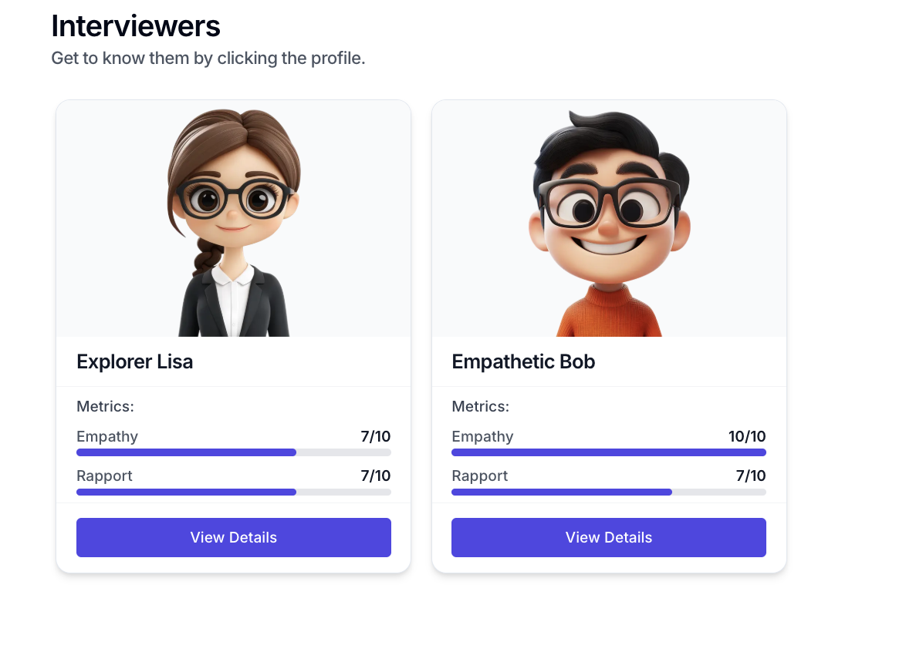
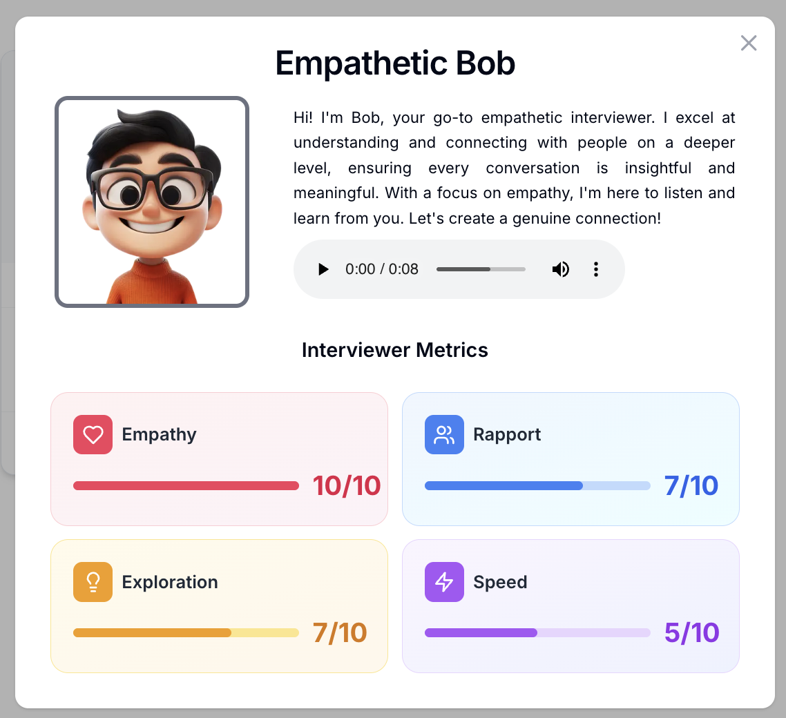
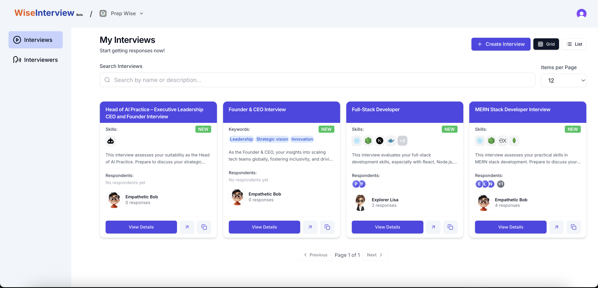
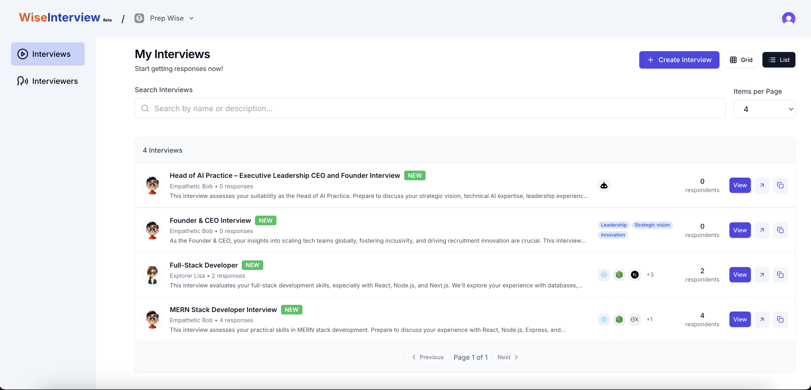
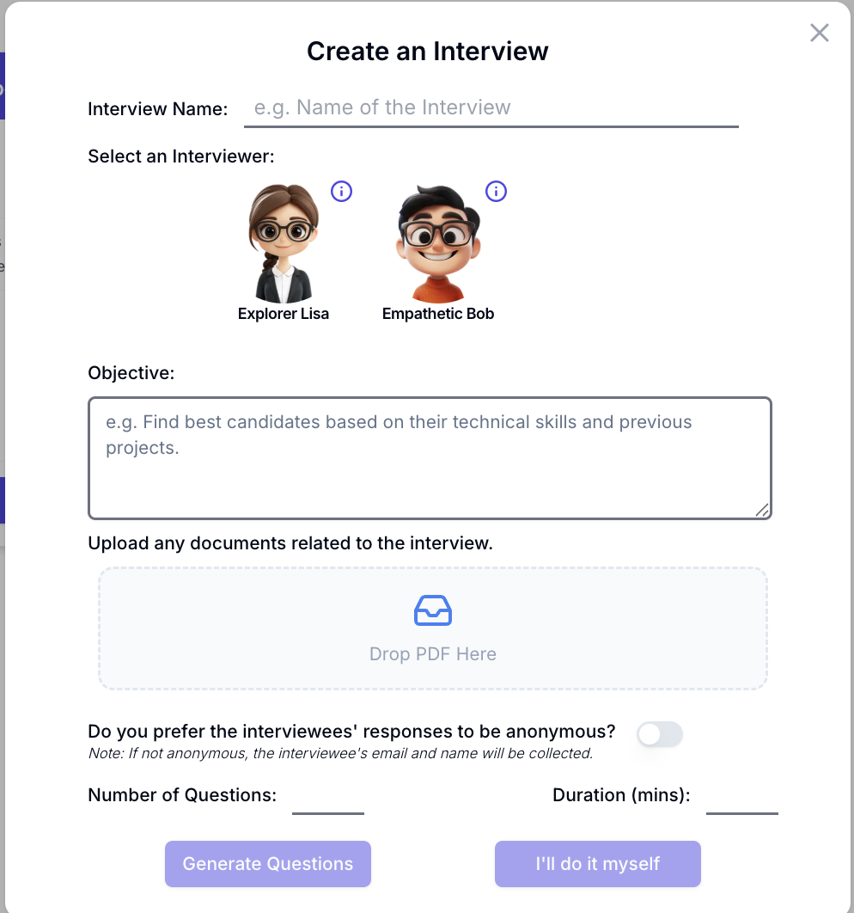
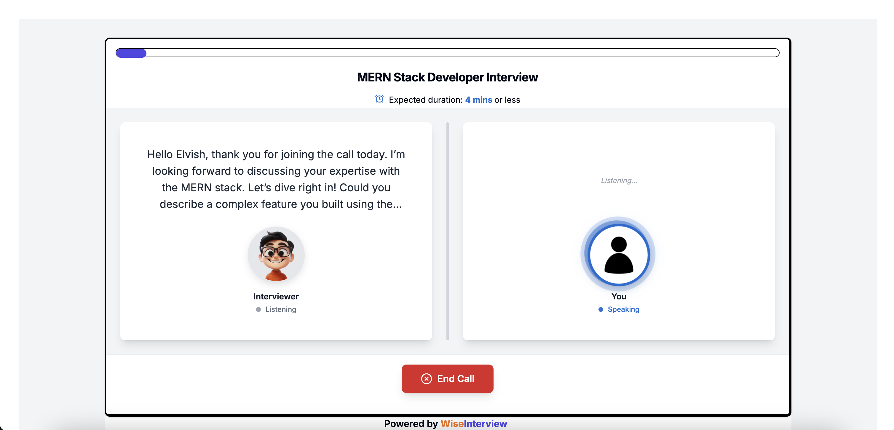

# Wise Interview - AI-powered voice interviewer for hiring 💼

Wise Interview is an open source platform for companies to conduct AI powered hiring interviews with their candidates.

## Key Features

-  Interview Creation:** Instantly generate tailored interview questions from any job description.
-  One-Click Sharing:** Generate and share unique interview links with candidates in seconds.
-  AI Voice Interviews:** Let our AI conduct natural, conversational interviews that adapt to candidate responses.
-  Smart Analysis:** Get detailed insights and scores for each interview response, powered by advanced AI.
-  Comprehensive Dashboard:** Track all candidate performances and overall stats .

## Initial Setup

1. Clone the project.

```bash
git clone https://github.com/WiseInterview/WiseInterview.git
```

2. Copy the existing environment template file

```bash
cp .env.example .env
```

## Clerk Setup ([Clerk](https://clerk.com/))

We use Clerk for authentication. Set up Clerk environment variables in the `.env` file. Free plan should be more than enough.

1. Navigate to [Clerk](https://dashboard.clerk.com/) and create an application following the [setup guide](https://clerk.com/docs/quickstarts/setup-clerk).


2. Your `.env` (NOT `.env.local`) file should have the `NEXT_PUBLIC_CLERK_PUBLISHABLE_KEY` and `CLERK_SECRET_KEY` variables populated with **no inverted commas**

3. Enable organizations in your Clerk application by navigating to the [Organization Settings](https://dashboard.clerk.com/last-active?path=organizations-settings&_gl=1*58xbvk*_gcl_au*MTEzODk3NzAyMy4xNzM4NjQzMzU3*_ga*MzUyMTk4NzIwLjE3Mzg2NDM0NzY.*_ga_1WMF5X234K*MTczODczNzkxOC4zLjEuMTczODczNzkyNi4wLjAuMA..) page.


4. Make sure you create an organization and invite your email to it.

## Database Setup ([Supabase](https://supabase.com/))

Supabase is used for storing the data. It's really simple to set up and the free plan should suffice.

1. Create a project (Note down your project's password)
2. Got to SQL Editor and copy the SQL code from `supabase_schema.sql`


3. Run the SQL code to confirm the tables are created.
4. Copy the supabase url and anon key from the project settings and paste it in the `.env` file in `NEXT_PUBLIC_SUPABASE_URL` and `NEXT_PUBLIC_SUPABASE_ANON_KEY`

## Retell AI Setup ([Retell AI](https://retell.ai/))

We use Retell AI to manage all the voice calls. They manage storage of recordings and provide a simple SDK to integrate with. They provide free credits to start with and will have to pay as you go.

1. Create an API key from [Retell AI Dashboard](https://dashboard.retellai.com/apiKey) and add it to the `.env` file in `RETELL_API_KEY`

## Add Google API Key

We use Google API to generate questions for interviews and analyze responses.

1. Go to [Google Cloud Console](https://console.cloud.google.com/) and create a new project
2. Enable the required APIs (Gemini API or relevant Google APIs)
3. Create an API key from the Credentials page
4. Add the API key to the `.env` file in `GOOGLE_API_KEY`

## Platform Overview

### 1. Interviewers Management

The **Interviewers Page** allows you to browse and manage AI interviewers available on the platform. Each interviewer has specific characteristics including empathy, rapport, exploration skills, and speed.



#### Interviewer Details Modal

Click on any interviewer card to view detailed information including their bio, voice introduction, and comprehensive metrics visualization.



**Key Features:**
- **Voice Introduction:** Hear the interviewer's voice and personality
- **Metrics Display:** Visual representation of interviewer characteristics:
  - **Empathy:** How well the interviewer understands candidate emotions
  - **Rapport:** Ability to build connection with candidates
  - **Exploration:** Depth of questioning and topic exploration
  - **Speed:** Interview pace and conversation flow

### 2. Interview Creation & Management

#### Interviews Page

The main dashboard displays all your created interviews with key information and quick actions.



#### Interviews Page - List & Grid View

View your interviews in both grid and list formats with advanced search and pagination capabilities.



**View Features:**
- **Grid View:** Display interviews as cards (4 per row) for visual overview
- **List View:** Compact row-based display for efficient browsing
- **Search Functionality:** Real-time search across interview names and descriptions
- **Pagination:** Navigate through interviews with customizable items per page (3-20)
- **Quick Filters:** Display skills, keywords, and respondent information at a glance
- **Create Button:** Quick access to create new interviews from the header

#### Create Interview

Create new interviews with customized configurations tailored to your hiring needs.



**Interview Creation Features:**
- **Job Description Input:** Paste job descriptions for AI-powered question generation
- **AI Question Generation:** Automatically generates interview questions using Google Gemini AI
- **Interviewer Selection:** Choose from multiple AI interviewers with different personalities
- **Share Links:** Generate unique interview links to share with candidates
- **Theme Customization:** Customize the interview interface with brand colors

### 3. Live Interview Experience

#### Candidate Interview Session

The live interview page showcases the AI interviewer conducting a real-time conversation with a candidate.



**Interview Capabilities:**
- **Real-Time Voice Conversation:** AI interviewer speaks naturally and listens to candidate responses
- **Adaptive Questions:** Questions adapt based on candidate answers using AI analysis
- **Response Recording:** All responses are recorded and stored securely
- **Powered by Retell AI:** Voice call management and recording using Retell AI's infrastructure
- **Flowise Integration:** AI conversation orchestration through Flowise for intelligent question routing and response analysis

### 4. Candidate Overview - List View

Track all candidates who have participated in interviews with aggregated statistics and performance metrics.


**List Features:**
- View all candidates in a sortable table format
- Quick performance overview
- Response count and interview statistics
- Quick action buttons for detailed analysis

### 5. Candidate-Specific Overview

Get detailed insights into individual candidate performance across all interviews.


**Detailed Analytics:**
- Individual interview scores and metrics
- Response quality analysis
- Skill assessment breakdown
- Performance trends across multiple interviews
- AI-generated feedback and recommendations
- Response playback and review

## Getting Started locally

First install the packages:

```bash
yarn
```

Run the development server:

```bash
yarn dev
```

Open [http://localhost:3000](http://localhost:3000) with your browser to see the result.

## Self Hosting

We recommend using [Vercel](https://vercel.com/) to host the app.

## Show Your Support 🌟

If you find Wise Interview helpful, please consider giving us a star on GitHub! It helps us reach more developers and continue improving the project.

## Contact

For questions or feedback, feel free to reach out:

- **Email:** [123pranavlaygude@gmail.com](mailto:123pranavlaygude@gmail.com)
- **LinkedIn:** [Pranav Laygude](https://www.linkedin.com/in/pranav-laygude-99bb24291/)
- **GitHub:** [playgude2](https://github.com/playgude2)

## License

The software code is licensed under the MIT License.
